# TinySpot  (后端代码)

## 项目简介

`TinySpot` 是基于SpringBoot + Vue开发的 AI聊天博客权限管理系统，前后端分离，后端采用了 SpringBoot、MyBatis-plus、MySQL、Redis、WebSocket、OAuth2.0 等技术，前端采用 Vue、element-ui 等。


源代码：

|   Gitee    |                        Github                         |
| :--------: |:-----------------------------------------------------:|
| 前端代码： |   前端代码：https://github.com/OnlyAPI/tiny-spot-vue.git  |
| 后端代码： | 后端代码：https://github.com/OnlyAPI/tiny-spot-service.git |

提示：前后端代码毫无保留，全部开源。


## 项目功能

- 首页数据统计 + 日历 （监控数据折线图数据展示 + 日历待办事项添加）
- **AI 聊天** （已接入国内多家AI模型供应商，可以方便的进行AI聊天）
- **AI 生图** （提供了文生图接口（百度）和扩展接口，使大家可以更方便的扩展接入多家服务）
- 系统权限管理 (这个就不多说了)
  - 用户管理
  - 角色管理
  - 菜单管理
- 博客管理
  - 文章管理 （提供markdown编辑器来编写、修改文章）
  - 标签管理 （对于博客标签的管理）
  - 分类管理 （对于博客分类的管理）
- 其他功能管理
  - 系统全局文件管理 （全局上传的文件提供管理页面）
  - 系统音乐管理 （播放音乐）

- OAuth2.0 授权登录 （[QQ](https://wiki.connect.qq.com/%E6%8E%88%E6%9D%83%E7%99%BB%E5%BD%95) + [Gitee](https://gitee.com/api/v5/oauth_doc#/) + [Github](https://docs.github.com/zh/apps/oauth-apps/building-oauth-apps/authorizing-oauth-apps#web-application-flow)）
- 文件上传 （可选择上传本地或者minio服务，并且预留存储扩展接口，在yml文件中修改配置即可）
  - 本地上传
  - [minio](https://github.com/minio/minio)


## 环境搭建

### 开发环境

| 工具 | 版本号 | 下载                                                         |
| -- | ------ | ------------------------------------------------------------ |
| JDK | 1.8    | https://www.oracle.com/technetwork/java/javase/downloads/jdk8-downloads-2133151.html |
| MySQL | 5.7    | https://www.mysql.com/                                       |
| Redis | 7.0    | https://redis.io/download                                    |
| nginx | 1.22   | http://nginx.org/en/download.html                            |


## 快速启动

### 后端服务

```
# 1.克隆完整项目
git clone https://github.com/OnlyAPI/tiny-spot-service.git

# 2.修改yml文件的MySQL和Redis配置

# 3.创建数据库(tiny_spot_origin)，执行doc文件夹下的sql文件，导入所有表，如需要使用AI功能，则需要导入配置，见下方 `数据库AI配置规则`

# 4.找到`Application`类，启动项目
```


## 数据库AI配置规则

- `ts_ai_config`表中的`auth_config`字段配置规则：(模型常量可按需配置)
  - chat-xunfei ([星火模型](https://www.xfyun.cn/doc/spark/Web.html)) :   generalv2:  APPID : APIKey : APISecret
  - chat-baidu （[文心一言](https://cloud.baidu.com/doc/WENXINWORKSHOP/s/Slfmc9dds)）： AppID : API Key : Secret Key
  - chat-aliyun （[通义千问](https://help.aliyun.com/zh/dashscope/developer-reference/api-details)）： qwen-turbo : APIKEY
  - txt2img-baidu （[百度文生图](https://cloud.baidu.com/doc/WENXINWORKSHOP/s/Slfmc9dds)）：AppID : API Key : Secret Key
  - chat-skylark（字节豆包模型）：skylark-chat : AK : SK
  - chat-baichuan（[百川模型](https://platform.baichuan-ai.com/docs/api)）：Baichuan2-Turbo : APIKEY : SECRETKEY


## 项目演示

登录页：
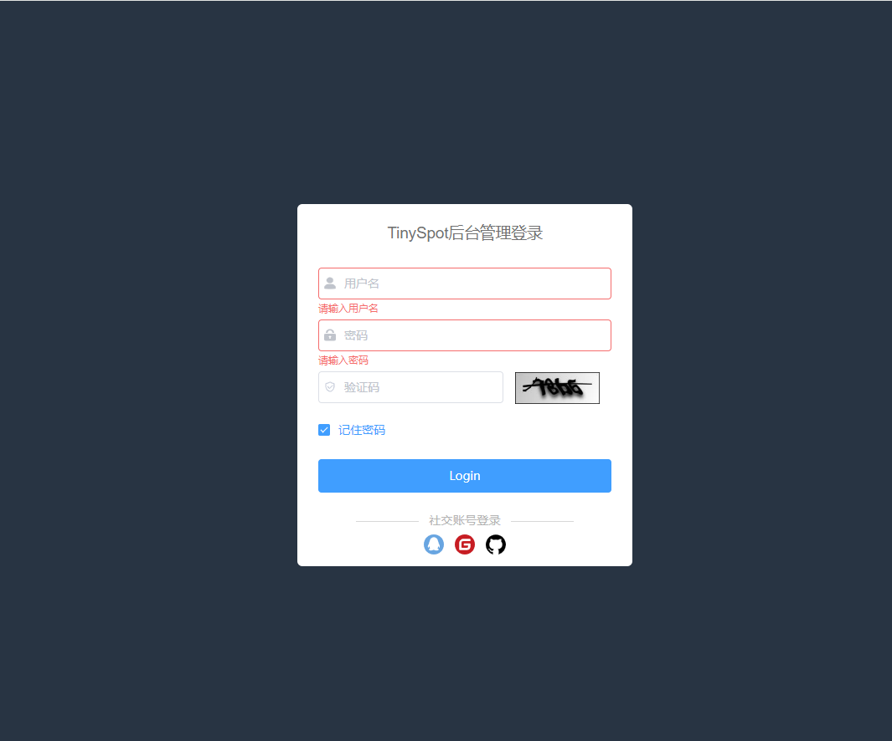

首页：

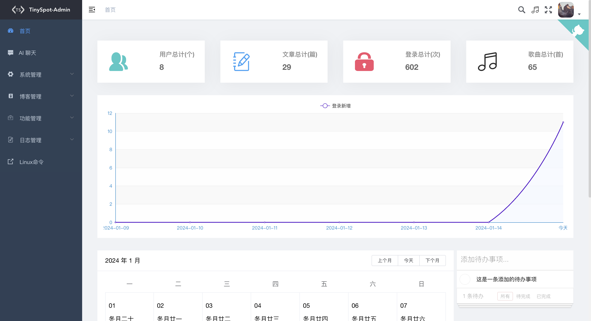

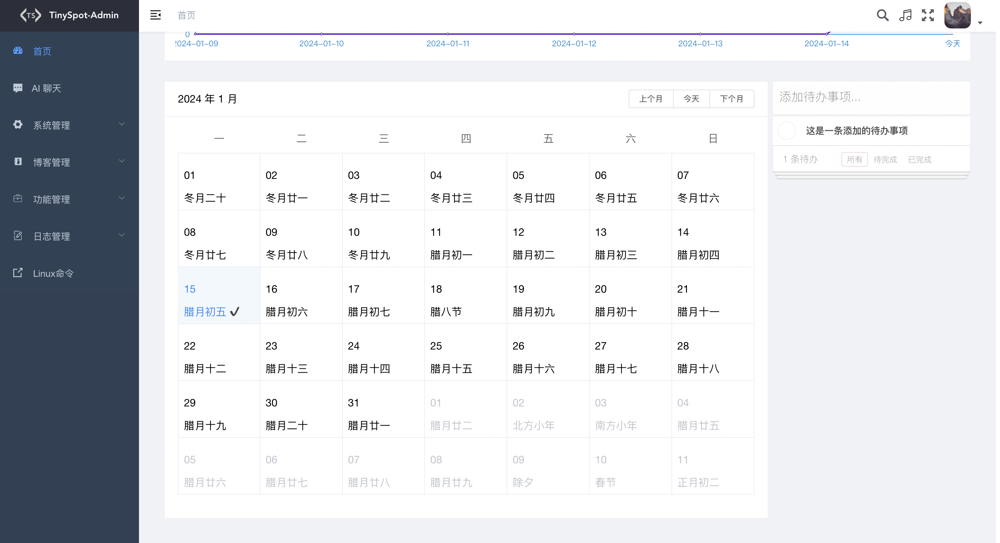


AI 聊天：

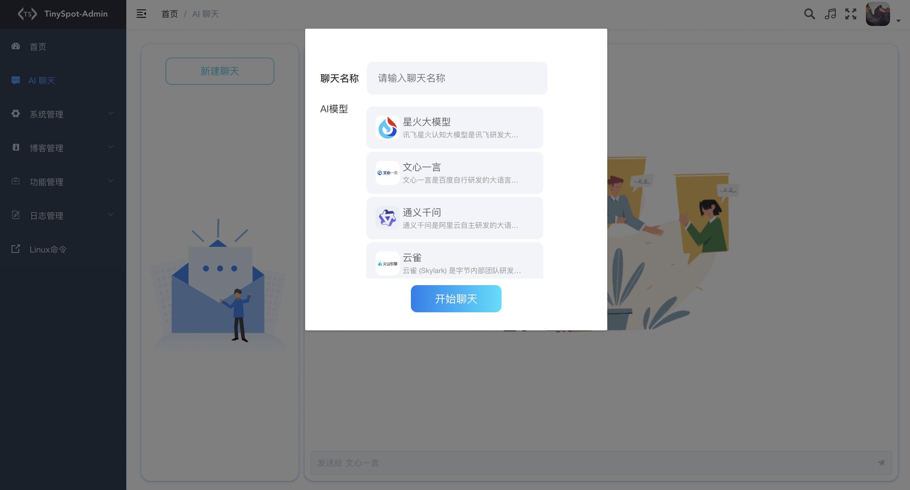

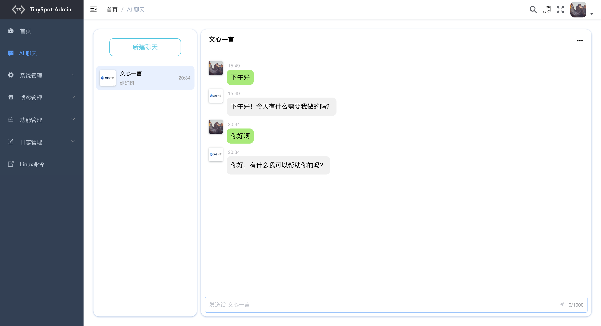


系统管理：

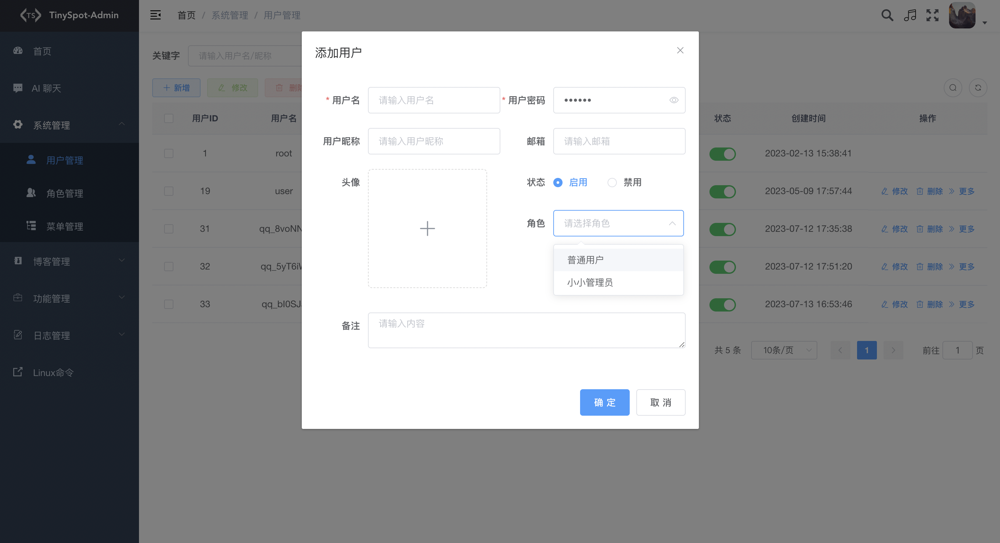

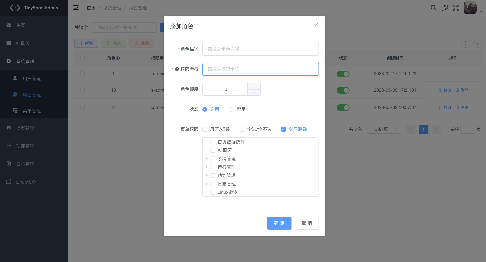

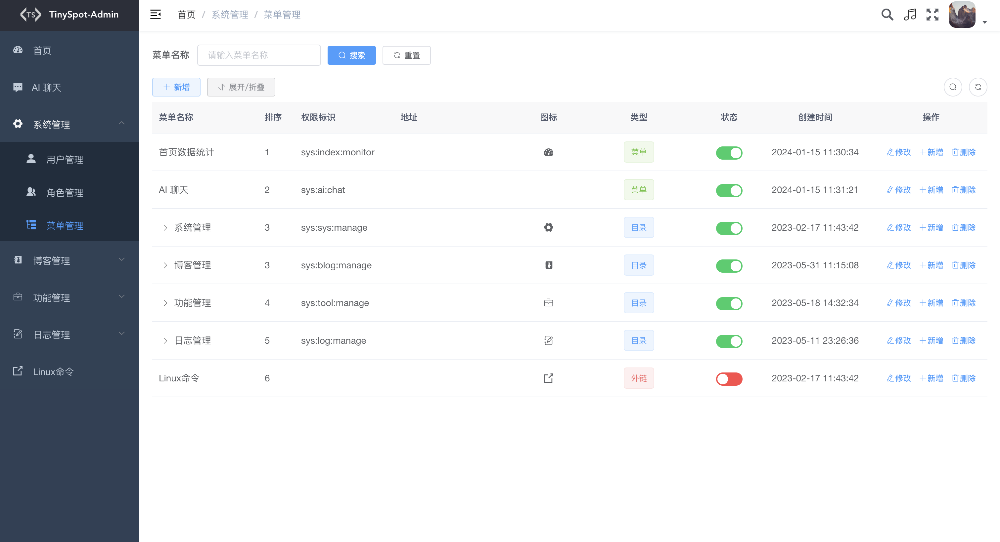

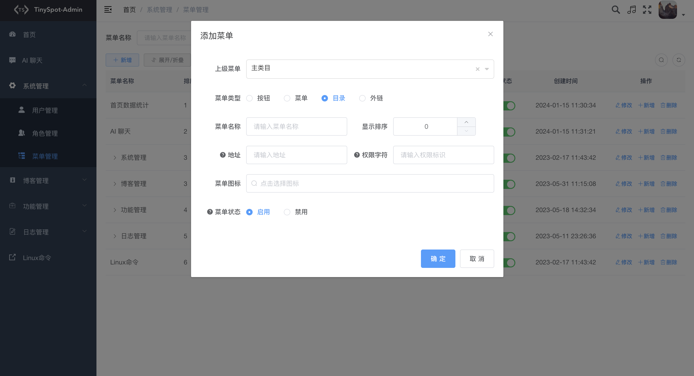


博客管理：

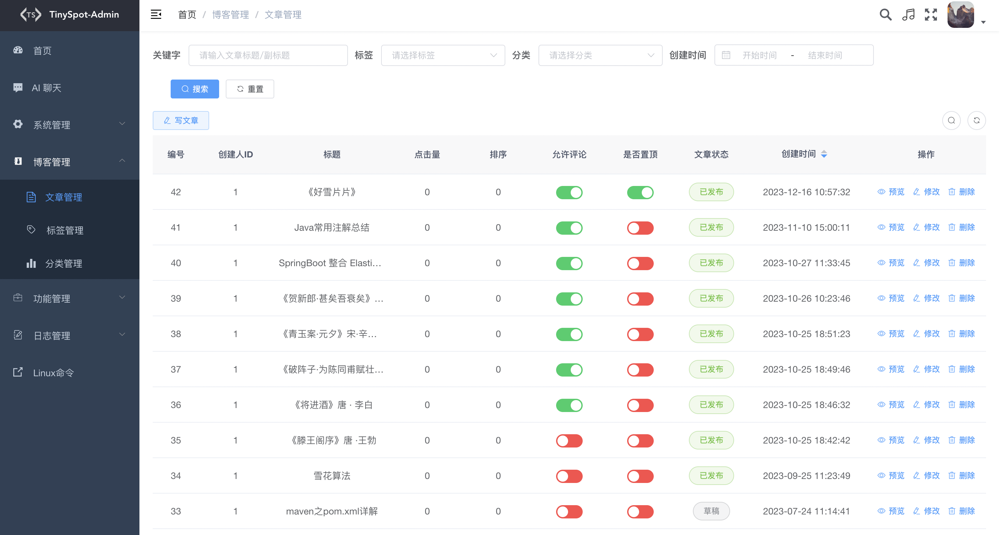

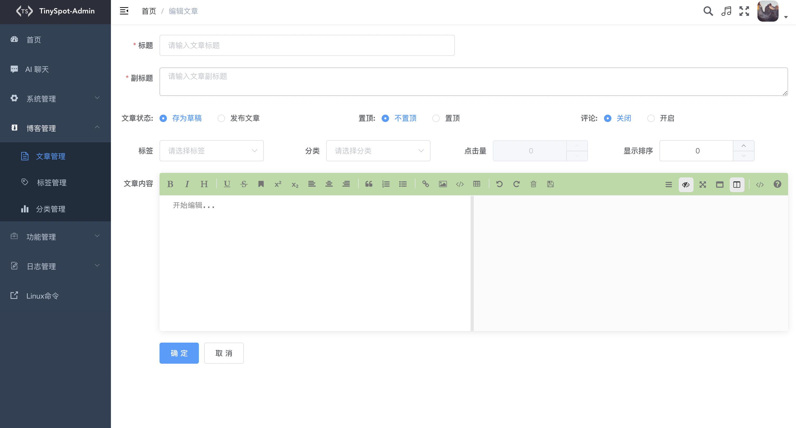

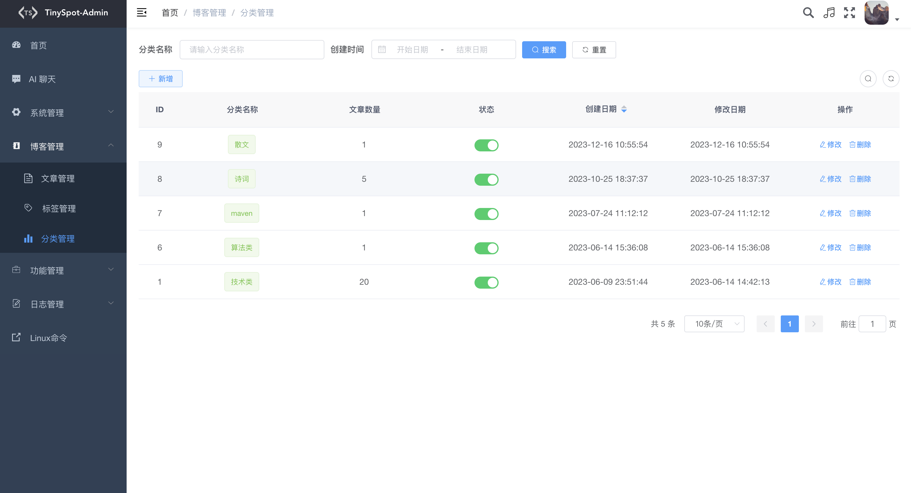


功能管理：

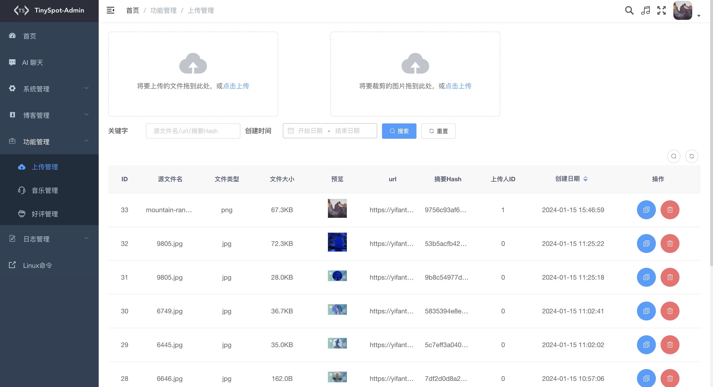

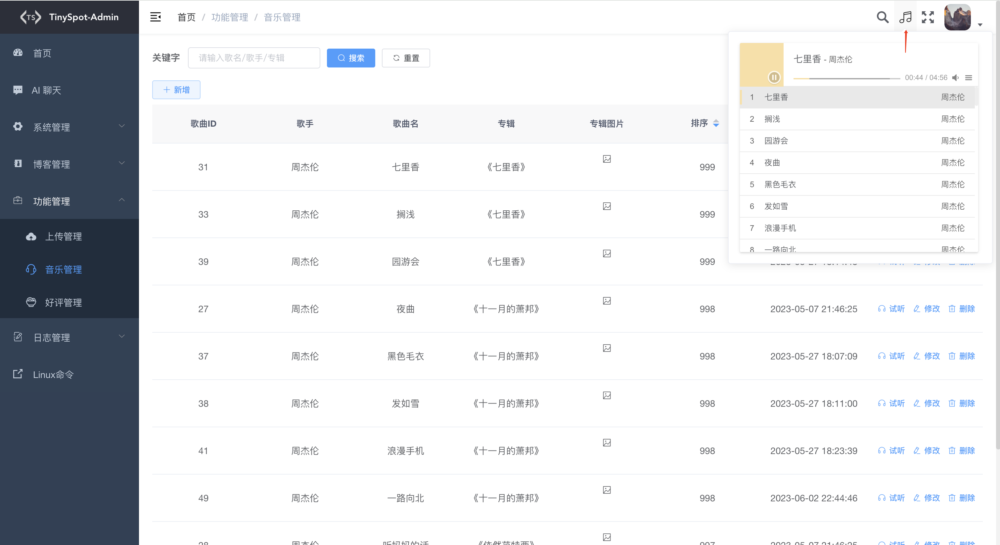


个人中心：

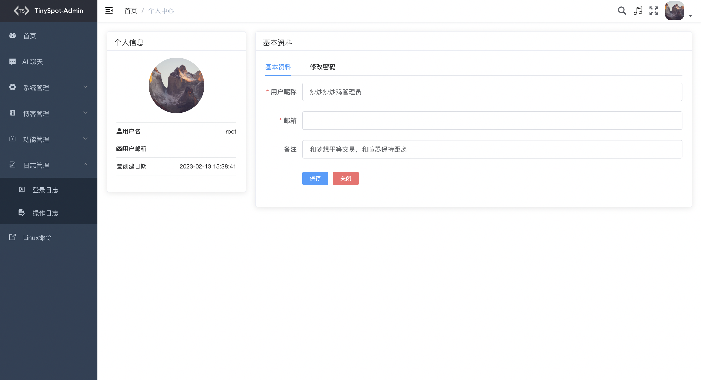


## 鸣谢

- 本人主要侧重Java开发，对于前端知识知之甚少，在项目开发中前端主要基于[vue-element-admin](https://github.com/PanJiaChen/Vue-element-admin) 和[RuoYi](https://github.com/yangzongzhuan/RuoYi)前端模板进行开发，感谢 @PanJiaChen 和 @yangzongzhuan 大佬提供的前端模板


## 说明

- 此项目为本人闲暇之余开发完成，所有代码全部开源，前后大概历经1年时间，跨度较久以及对前端代码不熟悉，避免不了有部分代码实现逻辑啰嗦，如发现不合理的地方可提出 Issues，大家一块学习成长。如果本项目对你有帮助的话，希望大家点个⭐ star ，感谢支持。